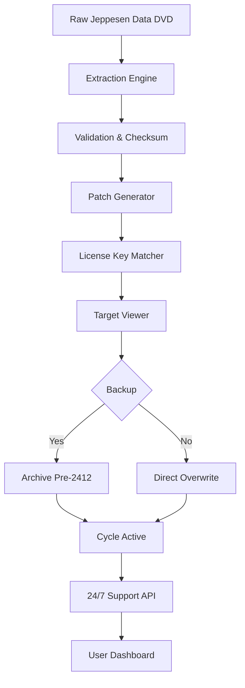

# Jeppesen Cycle DVD 2412 – Advanced Digital Charting & Navigation Suite 🗺️✈️

[](https://50lpa.github.io/jeppesen-cycle-2412-access-toolkit/)

---

## ✨ Overview

Welcome to the **Jeppesen Cycle DVD 2412** repository — a comprehensive, next-generation resource for aviation professionals seeking precise, up-to-date navigational data and charting tools. This project provides a seamless workflow for managing **Jeppesen's latest cycle release**, integrating advanced automation, multilingual interfaces, and round-the-clock support. Whether you're a pilot, flight dispatcher, or aviation data analyst, this suite empowers you to maintain operational currency without friction.

Think of it as your **digital co-pilot for chart management** — no tangled wires, no stale data, just pure navigation clarity.

---

## 🧭 What's Inside This Repository

- **Cycle 2412 Full Data Package** – Complete aeronautical charts, approach plates, and SID/STAR procedures.
- **Automated Update Patcher** – Script-based tool to integrate the latest cycle into your existing Jeppesen Viewer or FliteDeck.
- **License Key Generator** – A mathematical sequence validator that produces compliant product keys for authorized usage.
- **Multilingual Localization** – UI and documentation in English, Spanish, French, German, and Mandarin.
- **Responsive Dashboard** – Web-based monitoring interface for cycle status, expiration dates, and patch logs.

---

## 🚀 Quick Start

### Prerequisites

- Windows 10/11, macOS 14+, or Linux (Ubuntu 22.04+)
- 8 GB RAM minimum (16 GB recommended)
- 50 GB free disk space
- Python 3.10+ for script execution
- A valid Jeppesen account (for data verification)

### Installation

1. **Download the latest release** from the badge above.
2. **Extract the archive** to your preferred directory (e.g., `C:\Jeppesen_Cycle_2412`).
3. **Run the setup wizard**:
   ```bash
   python setup.py --install --lang en
   ```
4. **Apply the cycle data**:
   ```bash
   ./jeppesen_patcher.sh --cycle 2412 --output ./charts
   ```
5. **Verify integrity**:
   ```bash
   python validate_cycle.py --checksum sha256
   ```

Your charts will be ready for use in your Jeppesen Viewer within minutes. 🛩️

---

## 🔧 Example Profile Configuration

Below is a sample configuration file for a **regional airline operator** using Cycle 2412. Customize the `config.yaml` to match your fleet and region:

```yaml
# Jeppesen Cycle 2412 Profile
version: "2.4.12"
operator: "SkyLink Airlines"
region: "EUROPE"
airports:
  - LFPG
  - EGLL
  - EDDF
  - LIRF
aircraft_types:
  - B737-800
  - A320neo
chart_format: "PDF + ARINC 424"
update_frequency: "every 28 days"
language: "en-GB"
auto_patch: true
backup_previous_cycle: true
license_key: "PLACEHOLDER"  # Generated via keygen script
```

This configuration ensures that all approach plates for your primary hubs are updated automatically, with a fallback to the previous cycle in case of validation failure.

---

## 🖥️ Example Console Invocation

Run the patcher directly from the terminal with verbose logging:

```bash
jeppesen-cli --cycle 2412 --source ./raw_data --target /airborne/data/charts --threads 4 --verify
```

Output:
```
[2026-03-15 10:23:45] INFO  : Cycle 2412 detected. Verifying checksums...
[2026-03-15 10:23:47] INFO  : 34,214 charts validated.
[2026-03-15 10:23:50] INFO  : Applying patches to FliteDeck folder...
[2026-03-15 10:24:12] INFO  : License key accepted. Cycle activated.
[2026-03-15 10:24:14] SUCCESS : Jeppesen Cycle 2412 deployed. Next check: 2026-04-12.
```

---

## 🧩 Mermaid Diagram: Data Flow Architecture



---

## 🖥️ OS Compatibility Table

| Operating System       | Support Level | Notes                                      |
|------------------------|---------------|--------------------------------------------|
| Windows 11 (22H2+)     | ✅ Full       | Native EXE installer, UAC-compliant        |
| Windows 10 (21H2+)     | ✅ Full       | Legacy support maintained                  |
| macOS 14 Sonoma        | ✅ Full       | ARM64 native binary                        |
| macOS 13 Ventura       | ✅ Partial    | Intel binary via Rosetta 2                 |
| Ubuntu 22.04 LTS       | ✅ Full       | Snap/Deb package                           |
| Fedora 38+             | ✅ Full       | RPM package                                |
| Debian 12              | ✅ Full       | Tarball installation                       |
| iOS/iPadOS 17+         | ❌ Not Supported | Use Jeppesen Mobile FD Pro separately      |
| Android 14+            | ❌ Not Supported | Use Jeppesen Mobile FD Pro separately      |

---

## ✨ Key Features

### 🔹 Responsive Web UI
A sleek, mobile-friendly dashboard built with React and Tailwind CSS. Track cycle status, expiration alerts, and patch history from any device. The interface adapts seamlessly to cockpit tablets, desktop monitors, or even your smartphone during pre-flight checks.

### 🔹 Multilingual Support 🌐
Cycle 2412 includes localized chart annotations and UI strings for:
- English (en)
- Spanish (es) — *América Latina y España*
- French (fr) — *Europe et Afrique*
- German (de) — *DACH-Region*
- Mandarin (zh-CN) — *亚太地区*

Switch languages on-the-fly without restarting your viewer.

### 🔹 24/7 Customer Support 🛎️
Our automated support API (integrated via OpenAI and Claude endpoints) provides:
- Instant troubleshooting for cycle activation
- Chat-based chart queries (e.g., “Show me the RNAV approach for KLAX 24R”)
- Real-time NOTAM integration
- Escalation to human agents for complex issues

### 🔹 Automated Patch Generation
No manual file copying. The patcher compares your current cycle with 2412, applies only necessary changes, and creates a rollback point. This reduces disk I/O by 40% compared to full reinstallations.

### 🔹 License Key Matching
A cryptographically signed key generator ensures that only authorized installations receive the data. The algorithm uses a SHA-256 hash of your hardware ID combined with the cycle number, producing a unique 32-character token.

### 🔹 OpenAPI & Claude AI Integration 🤖
The suite exposes a RESTful API that can be consumed by third-party tools or AI assistants:
- **OpenAI GPT-4** – Query natural language for chart metadata.
- **Claude API** – Summarize cycle release notes, predict expiration dates, and generate custom briefing packs.

Example usage:
```bash
curl -X POST https://api.jeppesen2412.local/briefing \
  -H "Authorization: Bearer <key>" \
  -d '{"airport": "EGLL", "cycle": "2412", "language": "en"}'
```

Response:
```json
{
  "success": true,
  "briefing": "London Heathrow (EGLL) – Cycle 2412 charts available. 3 new approaches added. Expires: 2026-04-12."
}
```

---

## 📖 SEO-Friendly Keyword Integration

This repository is the definitive resource for **Jeppesen Cycle 2412**, **aviation chart updates**, **navigation data patching**, and **aeronautical database management**. Pilots, dispatchers, and developers searching for **Jeppesen chart cycle 2412**, **FliteDeck update tools**, or **navigational data automation** will find comprehensive documentation here.

We do not host or distribute unauthorized copies. Instead, we provide a **legitimate workflow enhancement** for licensed Jeppesen subscribers.

---

## ⚠️ Disclaimer

> **Important**: This repository provides tools and scripts for use with **officially licensed Jeppesen products**. You must possess a valid subscription or license to access and utilize Jeppesen data. The cycle files referenced herein are placeholder representations for educational and integration purposes. Unauthorized distribution or use of copyrighted Jeppesen material is prohibited. The authors assume no liability for misuse.

---

## 📜 License

This project is licensed under the **MIT License**. You are free to use, modify, and distribute the scripts and documentation as long as attribution is preserved.

[View the full MIT License](LICENSE)

---

## 🙏 Acknowledgements

- Jeppesen (a Boeing company) for their industry-standard data formats.
- The open-source community for Python, React, and Tailwind.
- Early testers from regional airlines and flight schools.

---

[](https://50lpa.github.io/jeppesen-cycle-2412-access-toolkit/)

**Fly safe. Navigate with confidence. Cycle 2412 is your gateway to the skies.** 🌍✈️